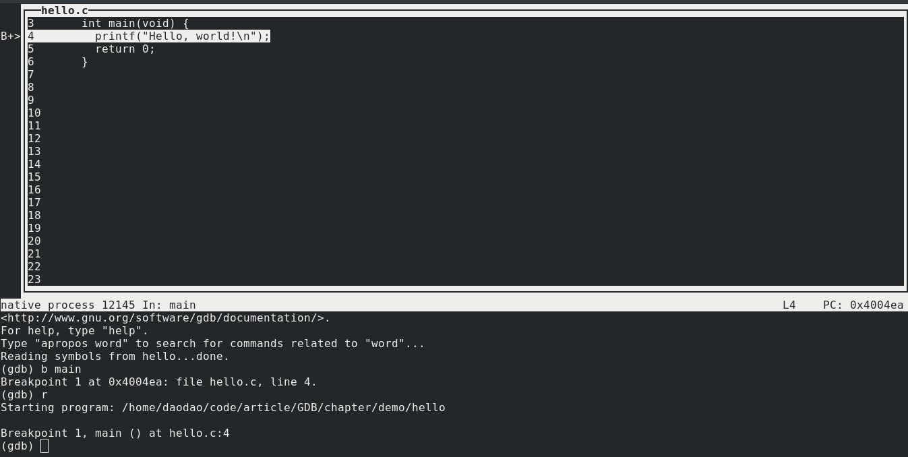

# 第二步：GDB 的调试过程

----

本章是一个非常快速和简单的指南，旨在让你从终端的命令行开始使用 GNU 调试器 gdb. 通常 gdb 是用过 IDE 运行的，但很多人出于各种原因避开 IDE，如果你也是，那么本章适合你。

## 编译 

我们同样还是使用这个简单的 `hello.c` 程序

```cpp
#include <stdio.h>

int main(void) {
  printf("Hello, world!\n");
  return 0;
}
```

你必须告诉编译器包含符号调试信息来编译代码。以下是在 gcc 中的使用方法， 添加 `-g` 选项：

```
gcc -g hello.c -o hello
```

## 启动调试器

首先要做的事情是：你可以在任何 gdb 提示符下输入 `help` 以获取更多信息。 此外，你可以输入 `quit` 退出调试器。 最后，只需敲回车将重复输入最后一个命令。 现在让我们开始吧！

有几种方法可以启动调试器（例如，如果你是一个IDE，你可能会使用一个不那么人性化的特定模式启动它）但我会在这里提到其中两个：控制台模式和 TUI 模式。 TUI 要更好一些，我们先快速看一下一个简单的样例，并在调试器中启动一个名为 `hello` 的程序：

```zsh
➜  demo gdb hello
GNU gdb (GDB) Fedora 8.1.1-3.fc28
Copyright (C) 2018 Free Software Foundation, Inc.
License GPLv3+: GNU GPL version 3 or later <http://gnu.org/licenses/gpl.html>
This is free software: you are free to change and redistribute it.
There is NO WARRANTY, to the extent permitted by law.  Type "show copying"
and "show warranty" for details.
This GDB was configured as "x86_64-redhat-linux-gnu".
Type "show configuration" for configuration details.
For bug reporting instructions, please see:
<http://www.gnu.org/software/gdb/bugs/>.
Find the GDB manual and other documentation resources online at:
<http://www.gnu.org/software/gdb/documentation/>.
For help, type "help".
Type "apropos word" to search for commands related to "word"...
Reading symbols from hello...done.
(gdb) run
Starting program: /home/daodao/code/article/GDB/chapter/demo/hello
Hello, world!
[Inferior 1 (process 11678) exited normally]
(gdb)
```

最后一行是 gdb 提示符，等待你告诉它该怎么做。输入 `r` 或 `run` 以运行该程序。 （gdb 允许缩写命令）

强烈建议你试试 TUI 模式，利用指令 `gdb -tui` 来启动调试器。（本章的例子将会使用终端模式来进行讲解，但日常使用基本都是 TUI 模式。

执行指令

```
gdb -tui hello
```

将看到如下截屏



一般 gdb 命令都能在 TUI 模式下工作，方向键和 pgup/pgdown 键将滚动源代码窗口（当它具有焦点时，默认情况下会这样做）。 此外，你可以使用命令 `list` 加行号来改变源码窗口中显示的文件或函数，例如，`list hello.c:5` 将显示 `hello.c` 的第5行

当前我们给命令行参数传递了可执行文件的名称。你也可以直接启动 gdb, 然后利用命令 `file hello` 来加载可执行文件 `hello`

如果你想向程序传递命令行参数，加在命令 `run` 后面就行了。

```zsh
➜  demo gdb hello
GNU gdb (GDB) Fedora 8.1.1-3.fc28
Copyright (C) 2018 Free Software Foundation, Inc.
License GPLv3+: GNU GPL version 3 or later <http://gnu.org/licenses/gpl.html>
This is free software: you are free to change and redistribute it.
There is NO WARRANTY, to the extent permitted by law.  Type "show copying"
and "show warranty" for details.
This GDB was configured as "x86_64-redhat-linux-gnu".
Type "show configuration" for configuration details.
For bug reporting instructions, please see:
<http://www.gnu.org/software/gdb/bugs/>.
Find the GDB manual and other documentation resources online at:
<http://www.gnu.org/software/gdb/documentation/>.
For help, type "help".
Type "apropos word" to search for commands related to "word"...
Reading symbols from hello...done.
(gdb) run arg1 arg2
Starting program: /home/daodao/code/article/GDB/chapter/demo/hello arg1 arg2
Hello, world!
[Inferior 1 (process 12605) exited normally]
(gdb) 
```

注意：当程序启动时候的 `Starting program`, 它显示参数 `arg1 arg2` 已经传给了 `hello`

## 断点

仅仅启动调试器去运行程序是没什么用的 -- 我们需要停止执行并进入单步模式

首先，在执行 `run` 命令前，需要在你想要停止的地方设置断点。你可以使用 `break` 或 `b` 命令，并指定一个位置，该位置可以是函数名和行号或源文件和行号。下面是设置断点的一些例子：

```
break main       # 在 main() 函数开始处设置断点
break 4	         # 在当前文件的第4行设置断点
break hello.c:4	 # 在 hello.c 的第4行设置断点
```

作为测试，我们在 main() 函数处设置断点，并启动程序：

```zsh
➜  demo gdb hello
GNU gdb (GDB) Fedora 8.1.1-3.fc28
Copyright (C) 2018 Free Software Foundation, Inc.
License GPLv3+: GNU GPL version 3 or later <http://gnu.org/licenses/gpl.html>
This is free software: you are free to change and redistribute it.
There is NO WARRANTY, to the extent permitted by law.  Type "show copying"
and "show warranty" for details.
This GDB was configured as "x86_64-redhat-linux-gnu".
Type "show configuration" for configuration details.
For bug reporting instructions, please see:
<http://www.gnu.org/software/gdb/bugs/>.
Find the GDB manual and other documentation resources online at:
<http://www.gnu.org/software/gdb/documentation/>.
For help, type "help".
Type "apropos word" to search for commands related to "word"...
Reading symbols from hello...done.
(gdb) b main
Breakpoint 1 at 0x4004ea: file hello.c, line 4.
(gdb) r
Starting program: /home/daodao/code/article/GDB/chapter/demo/hello

Breakpoint 1, main () at hello.c:4
4         printf("Hello, world!\n");
(gdb)
```

如你所见，我们的程序在执行时停止在了断点处。如果你运行在终端模式下，gdb 将会打印程序接下来所要执行的行。如果你运行在 TUI 模式，程序接下来所要执行的行将会高亮的显示在源码窗口。

可以使用 `info` 命令来列出当前的断点，如 `info breakpoints`(或者简写为 `i b`)

```
(gdb) b main
Breakpoint 1 at 0x4004ea: file hello.c, line 4.
(gdb) i b
Num     Type           Disp Enb Address            What
1       breakpoint     keep y   0x00000000004004ea in main at hello.c:4
(gdb)
```
可以使用带有断点位置的 `clear` 命令来清除断点。你也可以通过带有断点号的 `delete` 命令来清除断点。

此外，你也可以 `enable` 或者 `disable` 断点，但这两个命令将断点号而不是位置作为参数！断点的 enable/disable 状态可以通过断点列表（`info breakpoints`) 中的 `Enb` 列来查看到。

```
(gdb) b main
Breakpoint 1 at 0x4004ea: file hello.c, line 4.
(gdb) b hello.c:5
Breakpoint 2 at 0x4004f4: file hello.c, line 5.
(gdb) i b
Num     Type           Disp Enb Address            What
1       breakpoint     keep y   0x00000000004004ea in main at hello.c:4
2       breakpoint     keep y   0x00000000004004f4 in main at hello.c:5
(gdb) disable 1
(gdb) i b
Num     Type           Disp Enb Address            What
1       breakpoint     keep n   0x00000000004004ea in main at hello.c:4
2       breakpoint     keep y   0x00000000004004f4 in main at hello.c:5
(gdb) clear main
Deleted breakpoint 1
(gdb) delete 2
(gdb) i b
No breakpoints or watchpoints.
(gdb)
```

## 单步

一旦执行在断点处停止，你就可以告诉调试器再做一些事情。 让我们从 `next` 命令（或 `n`）开始。此命令将你移动到当前函数中的下一个语句（如果你已经离开函数的末尾，则返回函数的调用者）

下面提供了示例。请记住，gdb 正在打印的是它即将在 `(gdb)` 提示符之前要执行的行。 并且当我们在 `printf()` 行上运行 `next` 时，我们会看到输出信息。

```
(gdb) b main
Breakpoint 1 at 0x4004ea: file hello.c, line 4.
(gdb) r
Starting program: /home/daodao/code/article/GDB/chapter/demo/hello

Breakpoint 1, main () at hello.c:4
4         printf("Hello, world!\n");
(gdb) next
Hello, world!
5         return 0;
(gdb) next
6       }
(gdb) next
__libc_start_main (main=0x4004e6 <main>, argc=1, argv=0x7fffffffd398, init=<optimized out>, fini=<optimized out>, rtld_fini=<optimized out>, stack_end=0x7fffffffd388) at ../csu/libc-start.c:342
342       exit (result);
(gdb) next
[Inferior 1 (process 6489) exited normally]
```

(`__libc_start_main` 表示有另外一个函数调用了你的 `main()` 函数！)

现在，请注意 `next` 单步执行了函数调用，这并不意味着着函数不会被调用，而是说 `next` 将一直执行函数，直到该函数执行完成，然后返回到当前函数的下一行。

如果你想要从当前函数中进入函数并逐行跟踪该函数，该怎么办？ 你可以使用 `step`（或 `s`）命令执行此操作。它除了将会进入函数，工作方式和 `next` 相同。

假如你厌倦了单步执行，只是想让程序再次运行。可以使用 `continue` （或 `c`) 命令来继续执行程序。

如果程序正在运行但你忘了设置断点怎么办？ 你可以敲击 `CTRL-C` 来在任意位置停止程序，终端将会返回 `(gdb)` 提示符。此时，你可以在你想要的地方设置断点，然后通过 `continue` 来到达（触发）断点。

一个小技巧是，只需敲击 `RETURN(回车）` 就会重复输入的最后一个命令，这样可以省去你一遍又一遍地输入 `next`。

## 检查变量

如果你希望在运行过程中检查某些变量，你可以使用 `display`，但前提是变量当前在范围内。每次步进执行代码时，都会显示变量的值（如果它在范围内）。

接下来我们将会换一个程序 `sleep.c` 作为示例，来进一步的讲解 GDB。

通过 `gcc` 编译
```
gcc -g sleep.c -o sleep
```

```cpp
#include <stdio.h>
#include <unistd.h>

int main(void) {
  int i = 1;

  while (i < 60) {
    i++;
    sleep(1);
  }

  return 0;
}
```

（下面的输出在行之间缺失了清晰的源码显示 --- 这些你可以在 TUI 模式下看到。想象一下你运行该程序的时候，可以看到高亮的条在源码之间跳跃）

```
(gdb) b main
Breakpoint 1 at 0x4004ee: file sleep.c, line 5.
(gdb) r
Starting program: /home/daodao/code/article/GDB/chapter/demo/sleep

Breakpoint 1, main () at sleep.c:5
5         int i = 1;
(gdb) disp i
1: i = 0
(gdb) next
7         while (i < 60) {
1: i = 1
(gdb) next
8           i++;
1: i = 1
(gdb) next
9           sleep(1);
1: i = 2
(gdb) next
7         while (i < 60) {
1: i = 2
(gdb) next
8           i++;
1: i = 2
(gdb) next
9           sleep(1);
1: i = 3
(gdb)
```

上面运行结果中， `i` 左边的数字，是变量的序号。可以通过这个数字来 `undisplay` 变量。如果你忘记了序号，可以通过 `info display` 来查看

```
(gdb) b main
Breakpoint 1 at 0x4004ee: file sleep.c, line 5.
(gdb) r
Starting program: /home/daodao/code/article/GDB/chapter/demo/sleep

Breakpoint 1, main () at sleep.c:5
5         int i = 1;
(gdb) display i
1: i = 0
(gdb) info display
Auto-display expressions now in effect:
Num Enb Expression
1:   y  i
(gdb) undisplay 1
```

如果你只想一次性了解变量的值，则可以打印它。在这里我们看到 `i` 的值是 1：

```
(gdb) next
7         while (i < 60) {
(gdb) print i
$2 = 1
```

还有一个方便的 `printf` 命令，你可以使用它来更好地格式化输出变量：

```
(gdb) printf "%d\n", i
1
(gdb) printf "%08X\n", i
00000001
(gdb)
```