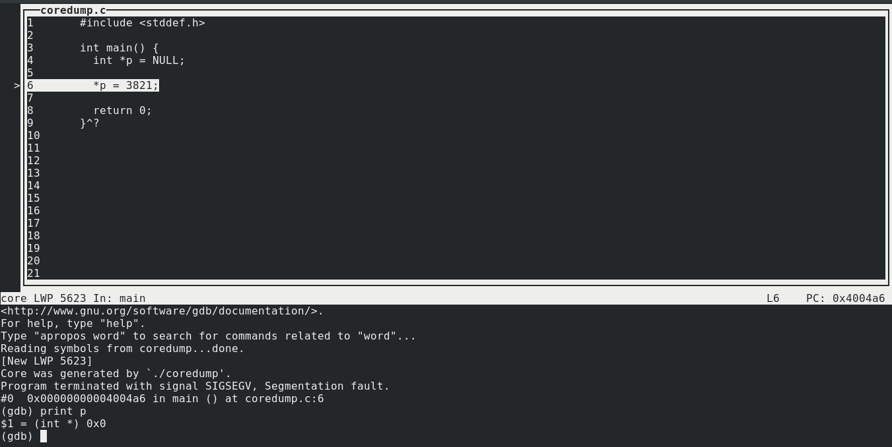
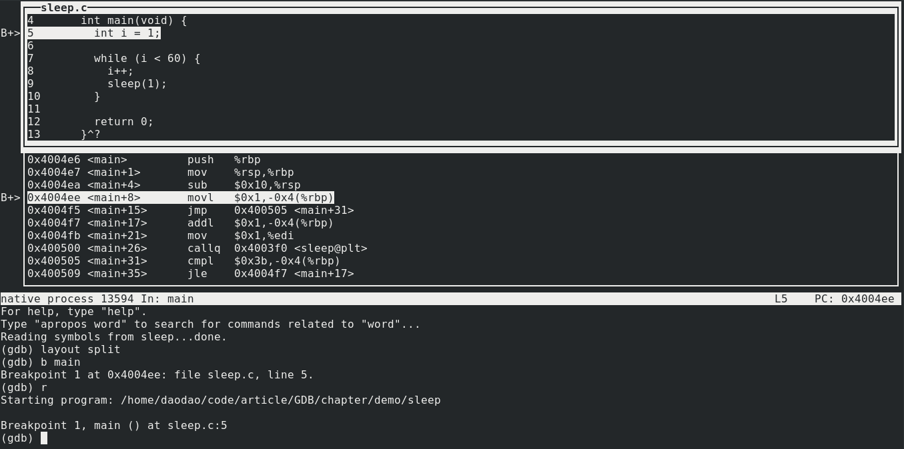

# 第三步：GDB 的高级功能

---

通过前面的两节，相信你已经学回了如何使用 gcc 来编译程序，以及 GDB 的一些基本调试流程。本章将介绍一些 GDB 中很常用的高级功能。

我们还是使用之前的 `sleep.c` 程序

通过 `gcc` 编译
```
gcc -g sleep.c -o sleep
```

```cpp
#include <stdio.h>
#include <unistd.h>

int main(void) {
  int i = 1;

  while (i < 60) {
    i++;
    sleep(1);
  }

  return 0;
}
```

## 堆栈操作

命令 `backtrace`（或 `bt`）将显示当前函数调用栈。调用者按顺序显示，当前函数显示在顶部：

```
(gdb) b main:6
Breakpoint 1 at 0x4004ee: file sleep.c, line 5.
(gdb) r
Starting program: /home/daodao/code/article/GDB/chapter/demo/sleep

Breakpoint 1, main () at sleep.c:5
5         int i = 1;
(gdb) bt
#0  main () at sleep.c:5
(gdb)
```

试试输入 `help stack` 来查看更多操作

## 其他单步方法

* 通过 `finish` 命令来退出当前函数，返回到调用函数
* 使用 `stepi` 来单步执行汇编指令
* 使用 `advance` 继续执行到一个指定位置，位置的指定方式同设置断点的方式一样。下面的示例演示了它会从当前位置一直前进直到第7行代码被执行到。

```
(gdb) list
1       #include <stdio.h>
2       #include <unistd.h>
3
4       int main(void) {
5         int i = 1;
6
7         while (i < 60) {
8           i++;
9           sleep(1);
10        }
(gdb) b main
Breakpoint 1 at 0x4004ee: file sleep.c, line 5.
(gdb) r
Starting program: /home/daodao/code/article/GDB/chapter/demo/sleep

Breakpoint 1, main () at sleep.c:5
5         int i = 1;
(gdb) advance 8
main () at sleep.c:8
8           i++;
(gdb)
```

如果你调用了一个函数 `foo()`, 你可以使用 `advance foo` 来前进到该函数。

## 跳到代码的任意部分

`jump` 命令与 `continue` 完全相同，只是它需要一个位置作为参数跳转。

如果需要在跳转目标处停止，请先在那里设置断点。

```
(gdb) list
1       #include <stdio.h>
2       #include <unistd.h>
3
4       int main(void) {
5         int i = 1;
6
7         while (i < 60) {
8           i++;
9           sleep(1);
10        }
(gdb) b 8
Breakpoint 1 at 0x4004f7: file sleep.c, line 8.
(gdb) r
Starting program: /home/daodao/code/article/GDB/chapter/demo/sleep

Breakpoint 1, main () at sleep.c:8
8           i++;
(gdb) j 8
Continuing at 0x4004f7.

Breakpoint 1, main () at sleep.c:8
8           i++;
(gdb)
```

## 在运行时更改变量和值

你可以使用 `set variable` 命令和要计算的表达式来在运行期间更改变量的值。你也可以通过使用带有括号表达式的 `set` 来简化此操作：

```
(gdb) b 8
Breakpoint 1 at 0x4004f7: file sleep.c, line 8.
(gdb) r
Starting program: /home/daodao/code/article/GDB/chapter/demo/sleep

Breakpoint 1, main () at sleep.c:8
8           i++;
(gdb) print i
$1 = 1
(gdb) set (i = 20)
(gdb) print i
$2 = 20
(gdb) set variable i = 40
(gdb) print i
$3 = 40
(gdb)
```

这与 `jump` 命令结合使用可以帮助你重复代码片段而无需重新启动程序。

## 硬件观察点

硬件观察点是特殊断点，只要表达式发生变化就会触发。通常，你只想知道变量何时更改（写入），为此你可以使用 `watch` 命令来操作它：

```
(gdb) b main
Breakpoint 1 at 0x4004ee: file sleep.c, line 5.
(gdb) r
Starting program: /home/daodao/code/article/GDB/chapter/demo/sleep

Breakpoint 1, main () at sleep.c:5
5         int i = 1;
(gdb) watch i
Hardware watchpoint 2: i
(gdb) continue
Continuing.

Hardware watchpoint 2: i

Old value = 0
New value = 1
main () at sleep.c:7
7         while (i < 60) {
(gdb) continue
Continuing.

Hardware watchpoint 2: i

Old value = 1
New value = 2
main () at sleep.c:9
9           sleep(1);
(gdb)
```

请注意：`watch` 将表达式作为参数，所以你可以使用变量名，或者一些更复杂的式子像 `*(p+5)` 或 `a[15]`。

你可以通过 `info break` 或 `info watch` 来得到 `watch points` 的列表。还可以通过 `delete` 加序号的方式来删除它们。

最后，你可以使用 `rwatch` 在读取变量的时候检测变量，使用 `awatch` 在读取或写入变量的时候检测变量。

## Attatch 到正在运行的进程

如果你的程序正在运行，但是你想要中断并调试它，首先您需要进程ID（PID）（通过 Unix 上的 `ps` 命令获取），然后你可以使用带有 PID 的 `attach` 命令来 attatch 到（中断）正在运行的程序。

为此，你可以通过无参的方式启动 gdb。

在下面的示例中，你可以观察到。首先我 attatch 到一个正在运行的进程，它告诉我实际上它正在一个叫做 `__nanosleep` 的函数里（因为我们的 `sleep` 程序里调用了 `sleep()` 函数），如果你安装了对应平台的 debuginfo，还可以像我这样看到具体函数执行的行号（28）以及内部细节信息。你可以使用 `backtrace` 来显示调用栈。因为有好几层调用栈，所以我使用了几次 `finish` 来回到 `main()` 函数。

```
➜  GDB ps -ef | grep sleep
daodao    3821  3284  0 10:30 pts/0    00:00:00 ./sleep
daodao    3879  3822  0 10:30 pts/2    00:00:00 grep --color=auto --exclude-dir=.bzr --exclude-dir=CVS --exclude-dir=.git --exclude-dir=.hg --exclude-dir=.svn sleep
➜  GDB gdb
GNU gdb (GDB) Fedora 8.1.1-3.fc28
Copyright (C) 2018 Free Software Foundation, Inc.
License GPLv3+: GNU GPL version 3 or later <http://gnu.org/licenses/gpl.html>
This is free software: you are free to change and redistribute it.
There is NO WARRANTY, to the extent permitted by law.  Type "show copying"
and "show warranty" for details.
This GDB was configured as "x86_64-redhat-linux-gnu".
Type "show configuration" for configuration details.
For bug reporting instructions, please see:
<http://www.gnu.org/software/gdb/bugs/>.
Find the GDB manual and other documentation resources online at:
<http://www.gnu.org/software/gdb/documentation/>.
For help, type "help".
Type "apropos word" to search for commands related to "word".
(gdb) attach 3821
Attaching to process 3821
Reading symbols from /home/daodao/code/article/GDB/chapter/demo/sleep...done.
Reading symbols from /lib64/libc.so.6...Reading symbols from /usr/lib/debug/usr/lib64/libc-2.27.so.debug...done.
done.
Reading symbols from /lib64/ld-linux-x86-64.so.2...Reading symbols from /usr/lib/debug/usr/lib64/ld-2.27.so.debug...done.
done.
0x00007f0a72c8d704 in __GI___nanosleep (requested_time=requested_time@entry=0x7ffed8e24b30,
    remaining=remaining@entry=0x7ffed8e24b30) at ../sysdeps/unix/sysv/linux/nanosleep.c:28
28        return SYSCALL_CANCEL (nanosleep, requested_time, remaining);
(gdb) backtrace
#0  0x00007f0a72c8d704 in __GI___nanosleep (requested_time=requested_time@entry=0x7ffed8e24b30,
    remaining=remaining@entry=0x7ffed8e24b30) at ../sysdeps/unix/sysv/linux/nanosleep.c:28
#1  0x00007f0a72c8d60a in __sleep (seconds=0) at ../sysdeps/posix/sleep.c:55
#2  0x0000000000400505 in main () at sleep.c:9
(gdb) finish
Run till exit from #0  0x00007f0a72c8d704 in __GI___nanosleep (requested_time=requested_time@entry=0x7ffed8e24b30,
    remaining=remaining@entry=0x7ffed8e24b30) at ../sysdeps/unix/sysv/linux/nanosleep.c:28
0x00007f0a72c8d60a in __sleep (seconds=0) at ../sysdeps/posix/sleep.c:55
55            if (__nanosleep (&ts, &ts) < 0)
Value returned is $1 = 0
(gdb) finish
Run till exit from #0  0x00007f0a72c8d60a in __sleep (seconds=0) at ../sysdeps/posix/sleep.c:55
main () at sleep.c:7
7         while (i < 60) {
Value returned is $2 = 0
(gdb) list
2       #include <unistd.h>
3
4       int main(void) {
5         int i = 1;
6
7         while (i < 60) {
8           i++;
9           sleep(1);
10        }
11
(gdb) print i
$3 = 43
(gdb) quit
A debugging session is active.

        Inferior 1 [process 3821] will be detached.

Quit anyway? (y or n) y
Detaching from program: /home/daodao/code/article/GDB/chapter/demo/sleep, process 3821
```

注意当我回到 `main()` 函数的时候，打印出变量 `i` 的值为 43 --- 因为此时我们的程序已经运行了 43 秒，`i` 每秒增长一次。

一旦我们退出调试器（detach 进程），程序将会继续正常运行下去。

将上面讲的结合 `set variable` 使用，你将能感受到 gdb 更强大的力量。

## 使用 Coredumps 进行程序尸检分析

假设你构建运行下面程序 `coredump.c` ，然后它因为某个原因挂掉了。

```cpp
#include <stddef.h>

int main() {
  int *p = NULL;

  *p = 3821;

  return 0;
}
```

```zsh
➜  demo gcc -g coredump.c -o coredump
➜  demo ./coredump
[1]    5623 segmentation fault (core dumped)  ./coredump
```

这意味着一个名叫 `core.5385` 的核心转储文件（程序崩溃时的内存快照）已经被创建。如果你没有看到 core 文件被创建（只显示了 `segmentation fault` ），也许是你设置的 ulimit 太低，在终端输入 `ulimit -c unlimited` 来增大它的值。

你也可以以 `root` 权限在终端输入 `echo core > /proc/sys/kernel/core_pattern` 来将生成的 core 文件设置到程序所在的目录。

接下来，使用 `-c` 选项指定 core 文件来启动 gdb:

```
gdb -tui -c core.5623 coredump
```

如果你同时使用 TUI 模式的话，你会看到一个信息屏幕，告诉你程序为什么退出（signal SIGSEGV, Segmentation fault），并且高亮出有问题的那一行（在终端模式下，有问题的行会被输出）

这个例子里，我打印出了导致 coredump 的变量。可以看到它是个空指针，在 C/C++ 里，解引用一个空指针，意味着你在访问一个被硬件保护的内存位置。因此操作系统会告诉你 `segmentation fault`。



即使你没有所有的源码，从程序崩溃的地方通过用 `backtrace` 也能获取到很有用的信息。

## 窗口函数

在 TUI 模式下，你可以使用 `info win` 命令获取现有窗口的列表。使用 `focus(fs)` 命令改变窗口的焦点。`focus` 的参数可以是窗口名、`prev` 或 `next`。有效的窗口名是 `SRC`(源码窗口)，`CMD`（命令窗口），`REGS`（寄存器窗口），和 `ASM`（汇编窗口）。有关如何使用这些其他窗口，请参阅下一部分。

请注意，当 `SRC` 窗口被聚焦时，方向键将会移动源码，当 `CMD` 窗口被聚焦时，方向键将会选择在命令历史记录里的上一条或下一条命令。

```
(gdb) info win
        src     (27 lines)  <has focus>
        cmd     (13 lines)
(gdb) fs cmd
Focus set to cmd window.
(gdb) info win
        src     (27 lines)
        cmd     (13 lines)  <has focus>
(gdb) fs src
Focus set to src window.
(gdb) 
```

(窗口名大小写无关)

## 显示寄存器和汇编

在 TUI 模式下，`layout` 命令控制你能看到哪个窗口。另外，`tui reg` 允许控制寄存器窗口，如果没有打开则会打开它。

具体命令如下

```
layout src          # 标准布局 --- 源码在顶部，命令行在底部
layout asm	        # 类似 src 布局，只是汇编码在窗口顶部
layout split      	# 三个窗口：源码在顶部，汇编在中间，命令行在底部
layout reg	        # 打开寄存器窗口
tui reg general	    # 显示常规寄存器
tui reg float	      # 显示浮点寄存器
tui reg system      # 显示系统寄存器
tui reg next	      # 显示下一页寄存器 --- 这是必要的，因为有可能有的寄存器不在 general、float、system 中
```

下面是展示了源码和汇编的窗口截图



在 Intel 机器上有两种版本的汇编代码：Intel 和 AT&T。 你可以使用 `set disassembly-flavor` 设置反汇编窗口中显示哪个。有效值为 `intel` 和 `att`。 如果你已经打开了汇编窗口，则必须将其关闭并重新打开它(比如说先 `layout src`， 然后 `layout split`)。

在终端模式下显示寄存器的话，输入 `info registers` 显示整数寄存器，或者 `info all-registers` 显示所有寄存器。