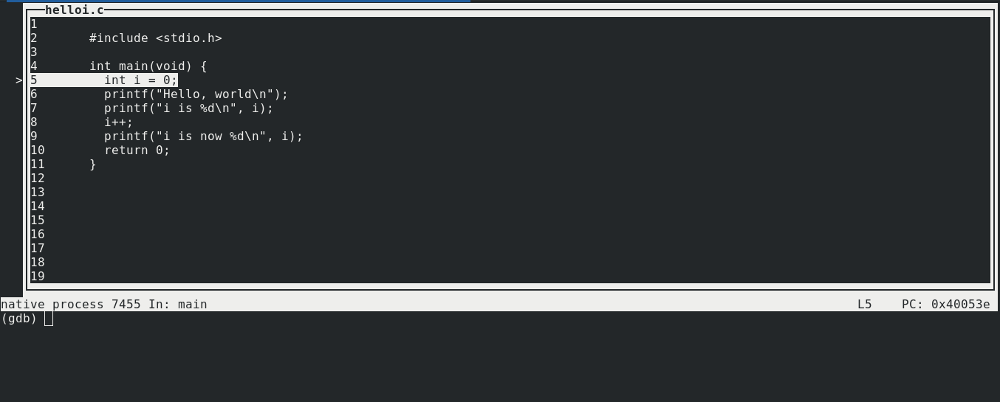
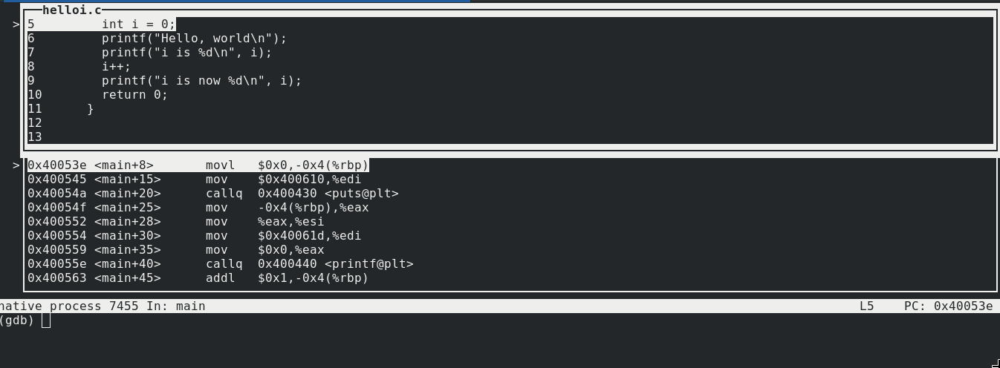
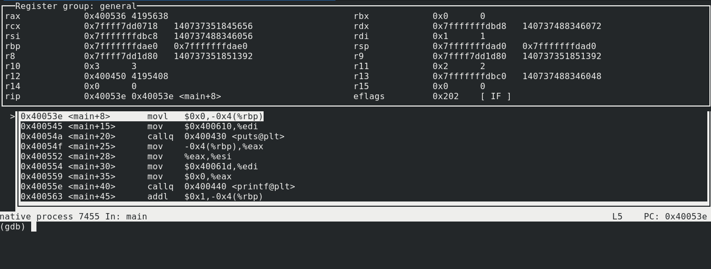

# 第四步：让 GDB 再高效一点 

---

经过前几节的学习，日常使用 GDB 对你来说应该没什么问题了。那么本章将介绍一些更便捷的用法，来提升你的调试效率。

本章我们将使用下面这个程序 `helloi.c` 来学习 GDB

```cpp

#include <stdio.h>

int main(void) {
  int i = 0;
  printf("Hello, world\n");
  printf("i is %d\n", i);
  i++;
  printf("i is now %d\n", i);
  return 0;
}
```

## 编译程序并用 GDB 打开可执行文件

编译

```
gcc -g helloi.c
```

启动 GDB

```
gdb a.out
```

## 更有效的使用 TUI 模式

为了节省用 `b main` 设置断点的时间，我们用 `start` 命令启动程序，它会暂停在 `main` 函数开始的地方

```
(gdb) start
Temporary breakpoint 1 at 0x40053e: file helloi.c, line 5.
Starting program: /home/daodao/code/article/gdb-intro/demo/a.out 

Temporary breakpoint 1, main () at helloi.c:5
5	  int i = 0;
(gdb) 
```

使用快捷键 `ctrl-x + a` 切换到 TUI 模式



使用快捷键 `ctrl-x + 2` (双窗口模式）调出汇编窗口



再使用快捷键 `ctrl-x + 2` 调出寄存器窗口



输入 `tui reg float` 显示浮点数寄存器窗口


结合 `ctrl-x + 2`，再使用快捷键 `ctrl-x + 1` 可以切换到单窗口模式（它会将顶部的窗口显示为单窗口）


如果在 TUI 模式下，默认方向键是对窗口中的源码执行移动，如果我们想要在指令输入窗口使用方向键来在指令历史里切换的话需要先输入 `fs cmd` 来改变窗口的聚焦。其实有更便捷的方式，使用快捷键 `ctrl-p` 显示上一条指令，`crtl-n` 显示下一条指令。


## Life is short, You need Python

如果在调试器里支持一种图灵完备的语言，那么调试起来更是得心应手。从 7.0 版本后，gdb 可以执行 python 脚本了。这让写 gdb 拓展，命令，操作数据变得非常简单。

首先，测试一下你的 gdb 是否支持 python

```
(gdb) python print('hello world')
hello world
```
ok，这个样子是没什么问题的，当然，打印 hello world 对调试没有太大帮助 :)

打印进程的 PID

```
(gdb) python
>import os
>print('my pid is %d' % os.getpid())
>end
my pid is 22088
(gdb) 
```

## 实现你自己的命令

另一个运行 python 脚本的方式是把它当作 `new gdb commands` 导入。这是在 gdb 里使用 python 最有用的方式，
基本的使用样例如下

```
import gdb

class SimpleCommand(gdb.Command):
    def __init__(self):
        # This registers our class as "simple_command"
        super(SimpleCommand, self).__init__("simple_command", gdb.COMMAND_DATA)

    def invoke(self, arg, from_tty):
        # When we call "simple_command" from gdb, this is the method
        # that will be called.
        print("Hello from simple_command!")


# This registers our class to the gdb runtime at "source" time.
SimpleCommand()
```

```
(gdb) source debug_hello.py 
(gdb) simple_command 
Hello from simple_command!
(gdb) 
```

就简单介绍到这里，更详细的诸如调试寄存器、优化输出等等，你可以通过 [GDB’s Python API](https://sourceware.org/gdb/onlinedocs/gdb/Python-API.html) 来进一步了解。